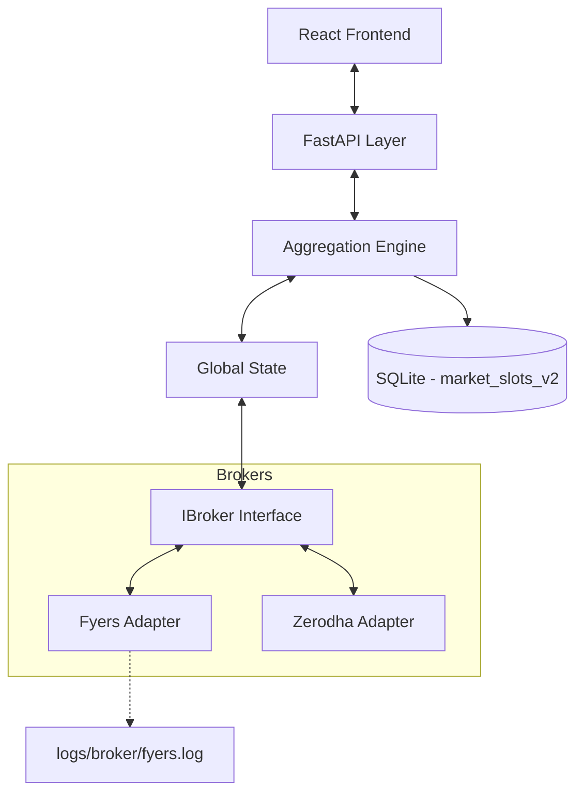
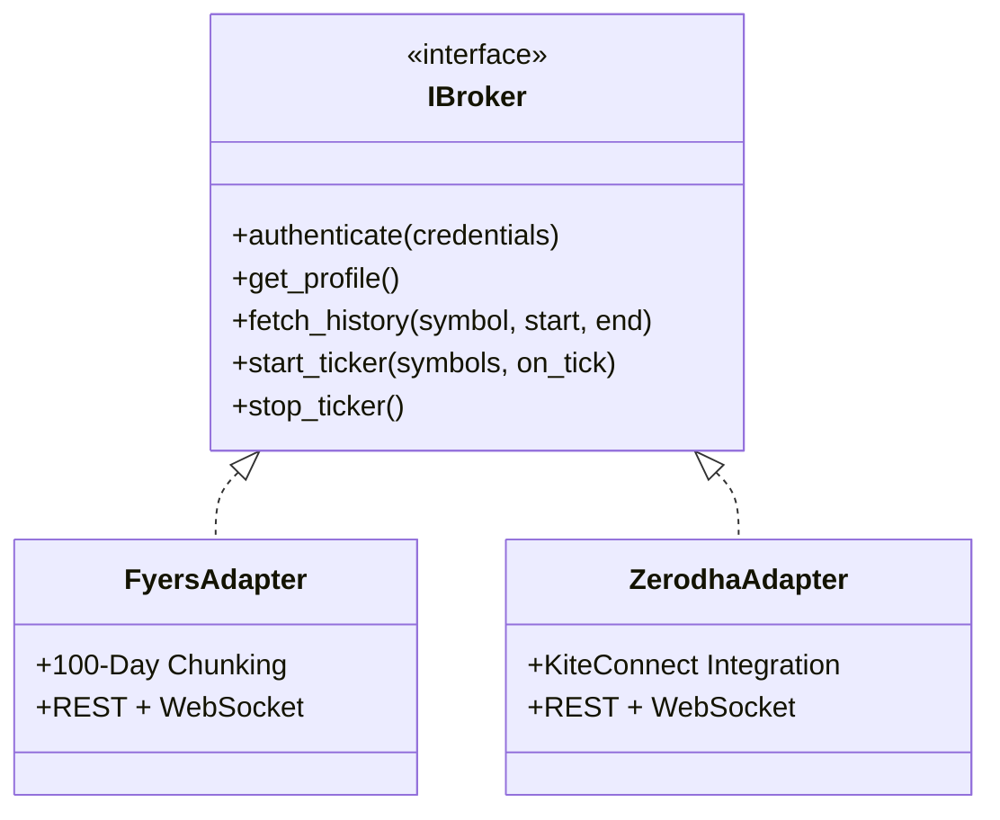
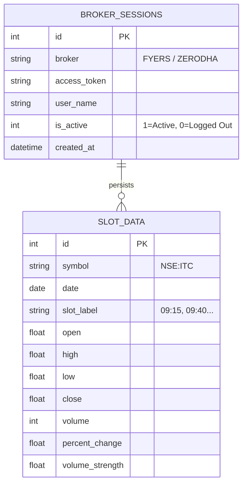
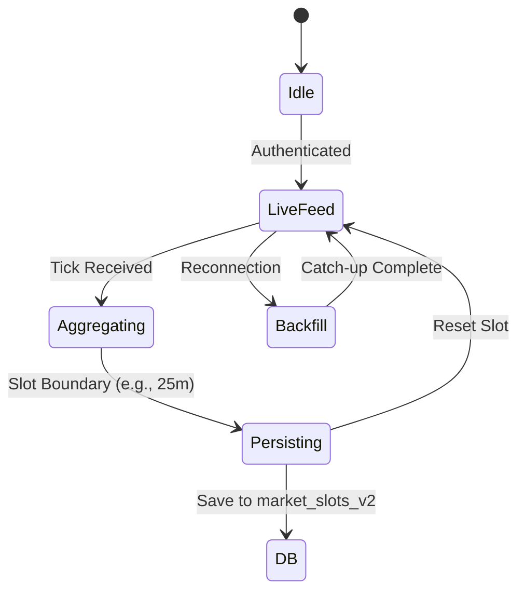

# QuantFlux: Architectural Blueprints

This document outlines the high-level architecture of the QuantFlux platform, focusing on modularity, data parity, and performance.

## Process Overview

The platform is built on a **Layered Modular Architecture** that separates broker-specific logic from core trading engines.

---

## 1. IBroker Interface (Adapter Pattern)
Defined in `app/broker_management/base.py`. This ensures the core engine never speaks "Kite" or "Fyers" specifically. New brokers can be added by implementing this interface without touching the business logic.

---

## 2. Unified Aggregator (Parity Engine)
Defined in `app/core/aggregator.py`.

The aggregator is a **State Machine** that ensures identical data processing regardless of the source:
- **Live Mode**: Subscribes to 1m candles via WebSockets.
- **Historical Mode**: Processes REST API results for backtesting.
- **Backfill Mode**: Automatically recovers missing data after a disconnection.

## 3. Async Database Layer
The platform utilizes **SQLAlchemy 2.0** with `aiosqlite` to handle high-frequency market data writes.

- **Storage**: `market_slots_v2.db` (SQLite)
- **Pattern**: Write-Ahead Logging (WAL) is enabled for simultaneous read/write performance.
- **Persistence Logic**:
    - **Sessions**: Stored on successful OAuth callback to enable auto-resumption.
    - **Slots**: Upserted (`ON CONFLICT`) every 25 minutes or whenever a slot boundary is crossed, ensuring data integrity during "catch-up" or backfills.

---

## 4. Broker-Specific Implementations
Each broker adapter handles specific API constraints to ensure a uniform experience.

### Fyers (100-Day Chunking)
Due to the Fyers API limit of 100 days for 1-minute historical data, the `FyersAdapter` implements an internal **request sequencer**:
1.  **Date Normalization**: Standardizes various input formats (DD/MM/YY, etc.) to ISO.
2.  **Chunking**: Splits large requests (e.g., 1 year) into 99-day safe segments.
3.  **Merge**: Joins the resulting candles into a single contiguous list for the core engine.

---

## 5. Testing & Validation Strategy
To ensure platform stability without requiring live market credentials during every build:

1.  **Broker Mocking**: Uses `unittest.mock` to simulate SDK responses from Fyers and Zerodha.
2.  **Aggregation Parity**: Verified that processed slots from Mock data match 1:1 with expected OHLCV calculations.
3.  **Latency Monitoring**: Internal performance counters track round-trip times for critical calls to ensure trading-readiness.
