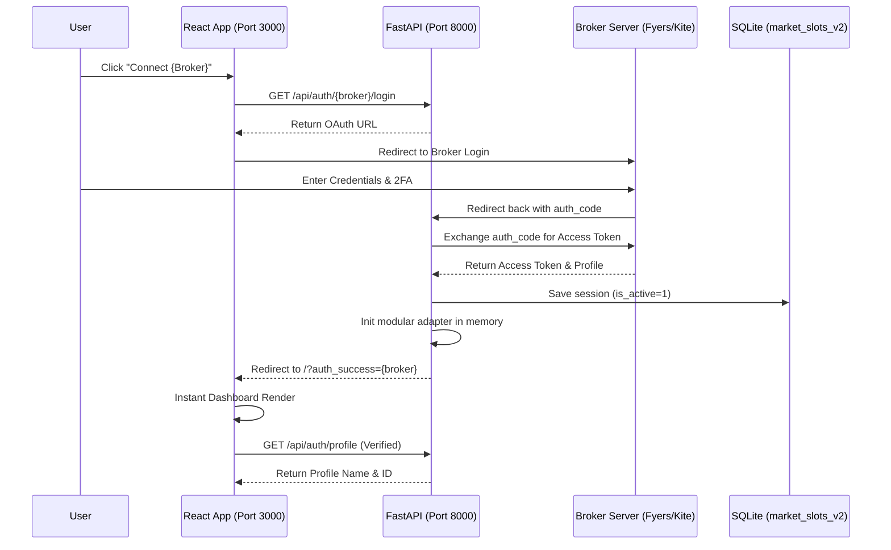

# QuantFlux: Authentication & Session Lifecycle (OAuth 2.0)

This document outlines the end-to-end lifecycle of a broker authentication session (Fyers or Zerodha) within the QuantFlux platform.

## Process Overview

The platform uses the **OAuth 2.0 Authorization Code Grant** flow. This ensures that user credentials (passwords/PINs) never touch our servers.

---

## Step-by-Step Lifecycle

### 1. Initiation (Frontend)
- **Action**: User selects a broker in the `SettingsView` or `BrokerLoginGate`.
- **Request**: `GET http://127.0.0.1:8000/api/auth/{broker}/login`.
- **Backend Logic**: The backend uses the broker SDK to generate a secure authorization URL containing your `APP_ID` and `REDIRECT_URI`.

### 2. Authentication (Broker)
- **Redirect**: The browser is sent to the broker's official site.
- **Verification**: The user logs in directly with the broker. Our platform **never** sees your password or TOTP.
- **Callback**: Upon success, the broker redirects the browser back to our backend callback (`/api/auth/{broker}/callback`).

### 3. Token Exchange & Persistence (Backend)
- **Token Swap**: The backend receives the `auth_code` and immediately performs a server-to-server swap for an **Access Token**.
- **Persistence**:
    - **Database**: The token is saved in `market_slots_v2.db` allowing for session recovery.
    - **Modular Adapter**: The system initializes the [FyersAdapter](file:///c:/Users/vjsg/.gemini/antigravity/playground/prograde-cassini/trading_platform/backend/app/broker_management/fyers.py) or Zerodha adapter in the global state.
- **Client Return**: The backend sends a final redirect to the frontend root with a success flag.

### 4. Auto-Resumption (Heartbeat)
- **The Problem**: If the backend server restarts, the in-memory state is lost.
- **The Solution**: The platform includes a **Heartbeat Mechanism**. The frontend periodically checks `/api/auth/status`. If the backend finds it has lost its in-memory session, it automatically hot-reloads the last active token from the database without asking for a re-login.

### 5. Termination (Logout)
- **Cleanup**: When you click Logout, the system STOPs the WebSocket ticker, clears the in-memory adapter, and marks the database session as `is_active = 0`. This ensures zero ghost traffic to the broker.

---

## Origin Criticality
The platform MUST be accessed via **http://127.0.0.1:3000**.
- **Security**: Browser storage (sessionStorage) treats `127.0.0.1` and `localhost` as different entities. To ensure the frontend correctly picks up the backend's session, always use the IP-based address.
