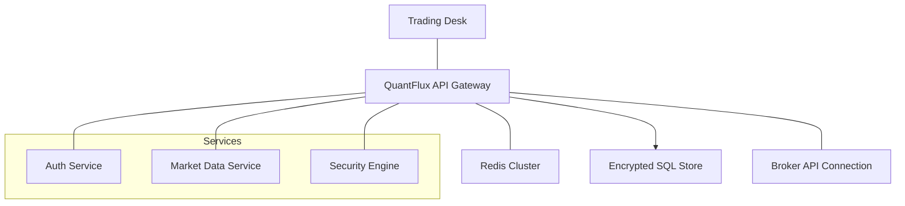
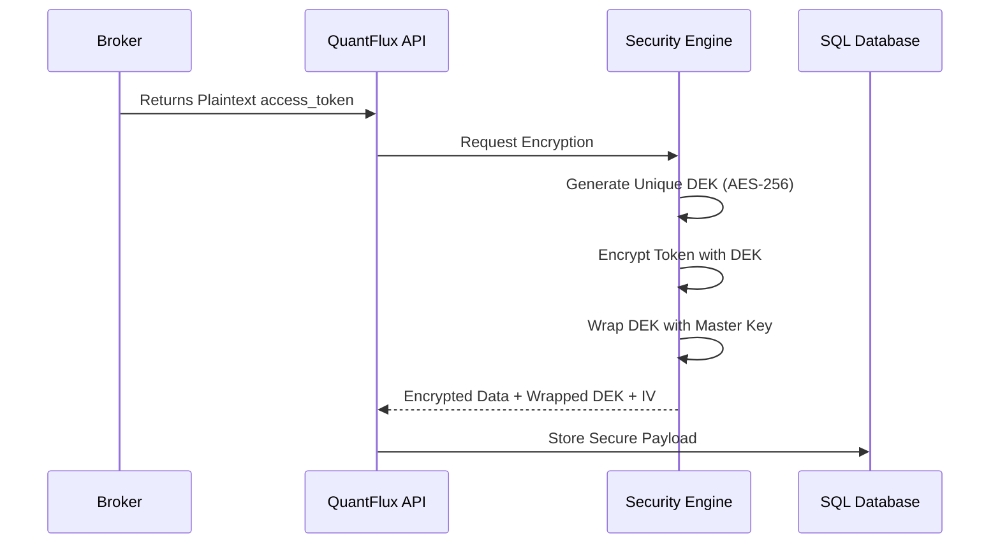
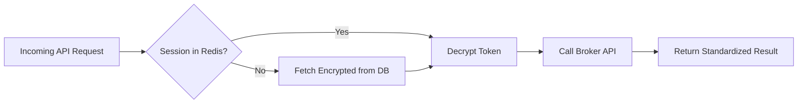
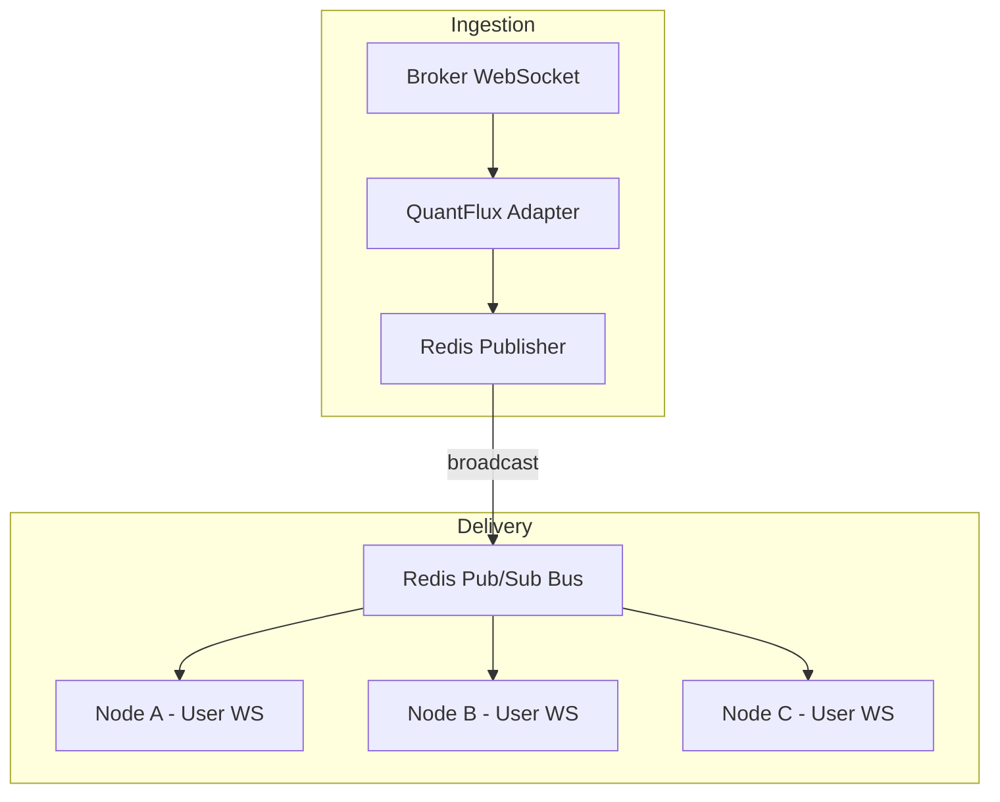
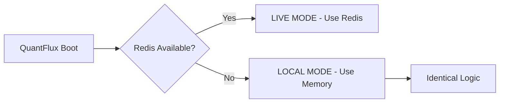
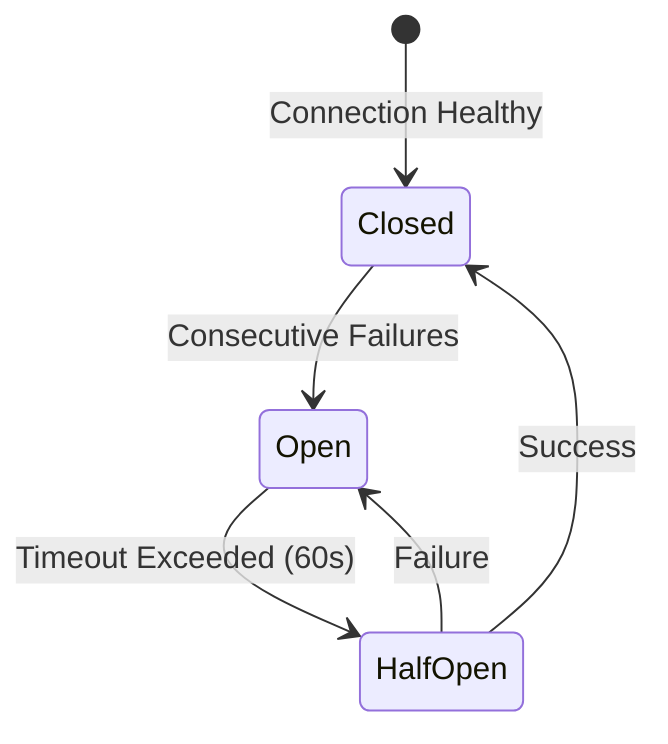

# QuantFlux: Unified Enterprise Architecture & Design Patterns

This master document provides the comprehensive technical specification and visual design patterns for the QuantFlux Enterprise platform. It details the end-to-end lifecycle of security, session management, and scalable data distribution.

---

## 🏗️ 1. High-Level System Architecture
QuantFlux follows a **Stateless Distributed Architecture**, allowing nodes to be added or removed without disrupting user sessions.

---

## 🔒 2. Zero-Trust Security (Envelope Encryption)
Tokens are never stored in plaintext. We utilize **Envelope Encryption** (AES-256-GCM) to ensure data at rest is unusable without the Master Key.

### Technical Specification:
1.  **Handshake:** User completes OAuth; Backend receives the `access_token`.
2.  **Encryption Process:** 
    - A unique **Data Encryption Key (DEK)** is generated via AES-256-GCM.
    - The `access_token` is encrypted using this DEK.
    - The DEK itself is "wrapped" (encrypted) using the platform's **Master Key**.
3.  **Encrypted Persistence:** The `encrypted_access_token`, `wrapped_dek`, and `iv` (Initialization Vector) are stored in the database.
4.  **Security Benefit:** Even if the database is compromised, tokens cannot be decrypted without the Master Key (stored in KMS/Environment).

### Workflow Diagram:

---

## 🌐 3. Stateless Coordination & Session Recovery
QuantFlux operates as a **Stateless Cluster**. API nodes do not store broker instances in local memory. Every request triggers a secure "Recapture" of the broker session.

### Technical Specification:
- **Request Recovery:** For every incoming market or order request, the node retrieves the encrypted session from Redis/DB and decrypts it on-the-fly.
- **Circuit Breaker Protection:** All outbound calls to Broker APIs are wrapped in a **Circuit Breaker**. If Fyers or Zerodha returns consistent failures, the circuit trips to `OPEN`, failing fast to protect system resources.

### Logic Flow:

---

## 📡 4. Scalable Market Data (Pub/Sub)
The system decouples **Data Ingestion** (Broker connection) from **Data Delivery** (User UI) using an Event-Driven pattern via Redis Pub/Sub.

### Technical Specification:
1.  **The Ingestor:** A dedicated thread/node maintains the WebSocket with the broker.
2.  **The Publisher:** As ticks arrive, they are standardized and published to a **Redis Channel** (`market:ticks:{symbol}`).
3.  **The Subscriber:** User-facing WebSocket handlers subscribe to these Redis channels.
- *Scalability Benefit:* 1,000 clients can watch NIFTY 50 without opening 1,000 connections to Fyers. They all consume from the single Redis broadcast.

### Distribution Diagram:

---

## 🏠 5. Local-Only Mode (Seamless Fallback)
The platform automatically adapts to developer environments without infrastructure dependencies.

- **Auto-Detection:** The system attempts to connect to Redis on boot.
- **Mock Fallback:** If the connection fails, it automatically switches to an **In-Memory Mock Client**.
- **Functional Parity:** The mock maintains the internal state (session data and subscriber callbacks) in memory, allowing all enterprise features to work identically on a single machine.

---

## 🩺 6. Reliability & Self-Healing
Proactive logic protects the engine from external failures and session expiration.

- **Audit Logging:** Every critical action generates a **Structured JSON Log** (`logs/security/audit_trail.json`), ready for ingestion into ELK/Grafana for SEBI compliance.
- **Proactive Maintenance:** A background worker scans the database for sessions expiring soon and automatically triggers a token refresh.

### Reliability State Machine:

---
**Final Note:** This design ensures QuantFlux remains **Secure**, **Stateless**, and **Cluster-Ready** across both local and enterprise-scale deployments.
